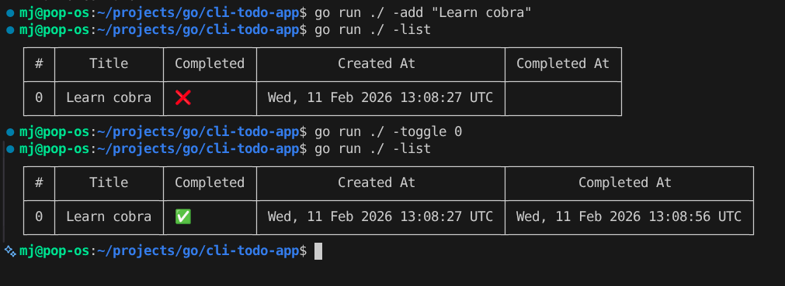

# CLI Todo App

A small Go CLI for managing todos with JSON file storage and a table-style list view.

### Preview


## Commands

```bash
go run ./ --add "Title here"
go run ./ --list
go run ./ --toggle <index>
go run ./ --del <index>
go run ./ --Edit <index>:"New title"
```
